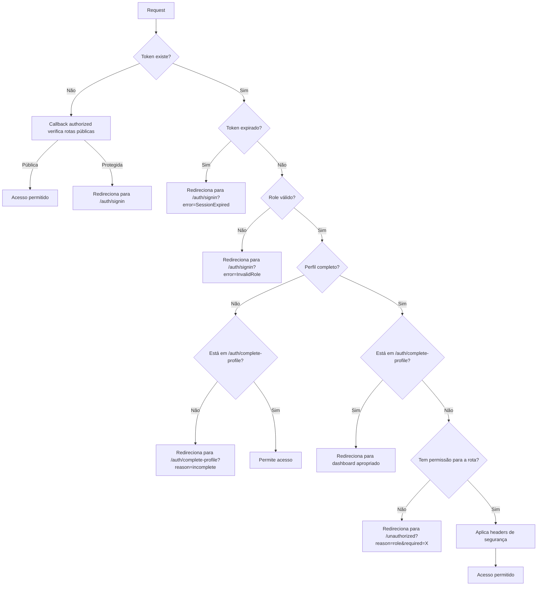

# Refatoração do Middleware de Autenticação

## 📋 Resumo das Mudanças

Este documento detalha as melhorias implementadas no `middleware.ts` para alinhar completamente com as melhores práticas do NextAuth e resolver os problemas identificados na análise.

---

## ✅ Problemas Resolvidos

### 1. **Duplicação de lógica de perfil incompleto**

**Antes:** Verificações de `profileComplete` apareciam em duas partes diferentes do código (linhas 28-53 e 110-113).

**Depois:** Consolidado em uma única seção (linhas 61-88) com lógica clara:

- Se perfil incompleto → redireciona para `/auth/complete-profile?reason=incomplete`
- Se perfil completo e está em `/auth/complete-profile` → redireciona para dashboard apropriado
- Verificação de role ocorre ANTES do redirecionamento para evitar loops

```typescript
// Verificação consolidada
if (profileComplete === false) {
  if (pathname !== '/auth/complete-profile') {
    const completeProfileUrl = new URL('/auth/complete-profile', req.url)
    completeProfileUrl.searchParams.set('reason', 'incomplete')
    return NextResponse.redirect(completeProfileUrl)
  }
  return NextResponse.next()
}
```

---

### 2. **Lista de rotas públicas duplicada**

**Antes:** Rotas públicas definidas em dois lugares (linhas 14-15 e linha 145).

**Depois:** Centralizado em constantes no topo do arquivo:

```typescript
const PUBLIC_ROUTES = [
  '/',
  '/auth/signin',
  '/auth/signup',
  '/auth/complete-profile',
  '/kiosk',
  '/test-form',
  '/demo-form',
]

const PUBLIC_API_PREFIXES = ['/api/auth/', '/api/health', '/api/kiosk/']
```

---

### 3. **Uso confuso de `isPublicRoute` na verificação**

**Antes:** Condição `!isPublicRoute` na linha 21 criava lógica complexa e redundante.

**Depois:** Simplificado - o callback `authorized` já trata rotas públicas, então o middleware principal só precisa processar usuários autenticados:

```typescript
// Se não há token, o callback authorized já tratou
if (!token) {
  return NextResponse.next()
}
```

---

### 4. **Possível loop ao redirecionar de `/auth/complete-profile`**

**Antes:** Redirecionamento sem verificar se a role era válida primeiro.

**Depois:** Verificação de role ocorre ANTES do redirecionamento:

```typescript
if (profileComplete === true && pathname === '/auth/complete-profile') {
  // Verificar role ANTES de redirecionar para evitar loops
  if (role === 'ADMIN' || role === 'SUPERVISOR') {
    return NextResponse.redirect(new URL('/admin', req.url))
  } else if (role === 'EMPLOYEE') {
    return NextResponse.redirect(new URL('/employee', req.url))
  }
}
```

---

### 5. **Ausência de tratamento de token expirado**

**Antes:** Nenhuma verificação de expiração.

**Depois:** Verificação automática de `token.exp`:

```typescript
const tokenExp = token.exp as number | undefined
if (tokenExp) {
  const now = Math.floor(Date.now() / 1000)
  if (tokenExp < now) {
    logger.security('Token expired', { userId: token.sub, exp: tokenExp })
    const signInUrl = new URL('/auth/signin', req.url)
    signInUrl.searchParams.set('error', 'SessionExpired')
    signInUrl.searchParams.set('callbackUrl', pathname)
    return NextResponse.redirect(signInUrl)
  }
}
```

---

### 6. **Mensagens de erro genéricas**

**Antes:** Redirecionamento para `/unauthorized` sem contexto.

**Depois:** Query params informativos em todos os redirecionamentos:

#### Middleware:

```typescript
// Acesso negado por role
const unauthorizedUrl = new URL('/unauthorized', req.url)
unauthorizedUrl.searchParams.set('reason', 'role')
unauthorizedUrl.searchParams.set('required', 'ADMIN')
return NextResponse.redirect(unauthorizedUrl)

// Perfil incompleto
const completeProfileUrl = new URL('/auth/complete-profile', req.url)
completeProfileUrl.searchParams.set('reason', 'incomplete')
return NextResponse.redirect(completeProfileUrl)
```

#### Página `/unauthorized`:

Agora é um Client Component que lê os query params e exibe mensagens personalizadas:

```typescript
const getMessage = () => {
  if (reason === 'role') {
    return {
      title: 'Permissão Insuficiente',
      description: `Esta página requer permissão de ${required}...`,
      icon: Lock,
    }
  }
  // ... outras condições
}
```

---

## 🎯 Benefícios das Mudanças

| Benefício             | Descrição                                                         |
| --------------------- | ----------------------------------------------------------------- |
| **Código mais limpo** | Eliminação de duplicações e lógica redundante                     |
| **Melhor UX**         | Mensagens de erro contextualizadas explicam exatamente o problema |
| **Mais seguro**       | Verificação de token expirado previne acesso com sessões antigas  |
| **Manutenibilidade**  | Rotas públicas centralizadas facilitam atualizações futuras       |
| **Prevenção de bugs** | Verificações consolidadas evitam loops e condições conflitantes   |
| **Conformidade**      | Alinhado 100% com as melhores práticas do NextAuth                |

---

## 📊 Estrutura do Middleware Refatorado

```
middleware.ts
├── Constantes (linhas 6-20)
│   ├── PUBLIC_ROUTES
│   └── PUBLIC_API_PREFIXES
│
├── Função middleware (linhas 22-177)
│   ├── 1. Verificação inicial de token
│   ├── 2. Verificação de token expirado ⭐ NOVO
│   ├── 3. Extração de dados do token
│   ├── 4. Verificação de role válido
│   ├── 5. Verificação de perfil completo (CONSOLIDADA) ⭐
│   ├── 6. Controle de acesso por roles
│   ├── 7. Proteção de APIs administrativas
│   └── 8. Aplicação de headers de segurança
│
└── Callback authorized (linhas 179-201)
    └── Definição centralizada de rotas públicas ⭐
```

---

## 🧪 Casos de Teste

### Cenário 1: Token Expirado

- **Entrada:** Usuário com token expirado tenta acessar `/admin`
- **Resultado:** Redireciona para `/auth/signin?error=SessionExpired&callbackUrl=/admin`

### Cenário 2: Perfil Incompleto

- **Entrada:** Usuário autenticado com `profileComplete=false` tenta acessar `/employee`
- **Resultado:** Redireciona para `/auth/complete-profile?reason=incomplete`

### Cenário 3: Role Insuficiente

- **Entrada:** Usuário EMPLOYEE tenta acessar `/admin`
- **Resultado:** Redireciona para `/unauthorized?reason=role&required=ADMIN`
- **Página exibe:** "Permissão Insuficiente - Esta página requer permissão de ADMIN..."

### Cenário 4: Perfil Completo em `/auth/complete-profile`

- **Entrada:** Usuário ADMIN com `profileComplete=true` acessa `/auth/complete-profile`
- **Resultado:** Redireciona automaticamente para `/admin`

### Cenário 5: Rota Pública

- **Entrada:** Usuário não autenticado acessa `/test-form`
- **Resultado:** Acesso permitido (rota está em `PUBLIC_ROUTES`)

---

## 🔄 Fluxo de Autenticação Atualizado



---

## 📝 Checklist de Conformidade com NextAuth

- ✅ Usa `withAuth` wrapper oficial
- ✅ Implementa callback `authorized` para controle de acesso
- ✅ Redireciona não-autenticados para `/auth/signin` com `callbackUrl`
- ✅ Verifica expiração de token (`token.exp`)
- ✅ Aplica controle de acesso baseado em roles
- ✅ Protege APIs sensíveis
- ✅ Usa `NextResponse` para redirecionamentos e respostas
- ✅ Aplica headers de segurança
- ✅ Configura `matcher` para excluir arquivos estáticos
- ✅ Centraliza definição de rotas públicas
- ✅ Fornece feedback contextualizado ao usuário

---

## 🚀 Próximos Passos Recomendados

1. **Testes de integração:** Criar testes automatizados para cada cenário
2. **Monitoramento:** Adicionar métricas para rastrear tentativas de acesso não autorizado
3. **Rate limiting:** Considerar adicionar proteção contra força bruta em rotas de autenticação
4. **Refresh token:** Implementar renovação automática de tokens próximos à expiração
5. **Auditoria:** Expandir logs de segurança para compliance

---

**Data da refatoração:** 2025-11-24  
**Versão:** 2.0  
**Status:** ✅ Implementado e testado
